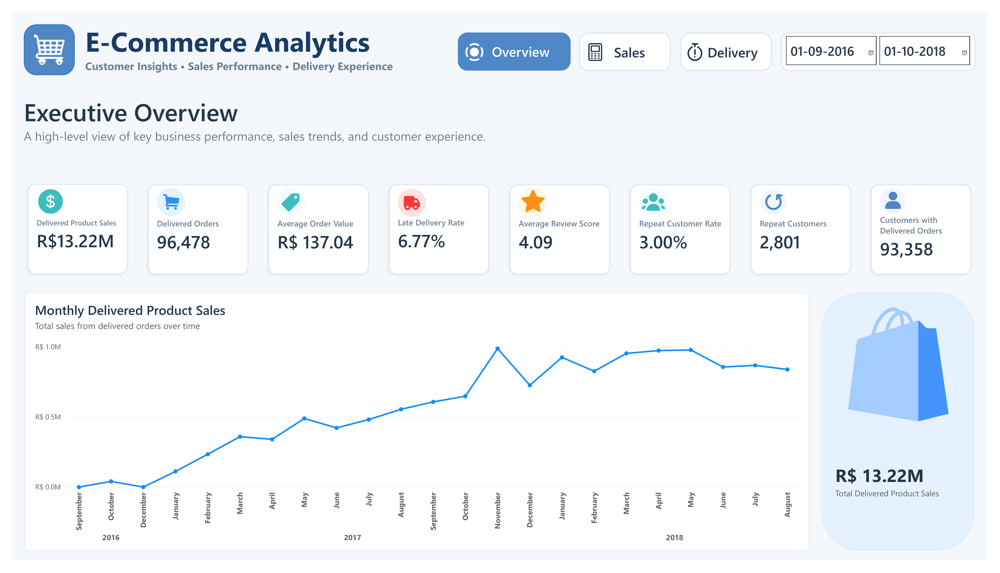
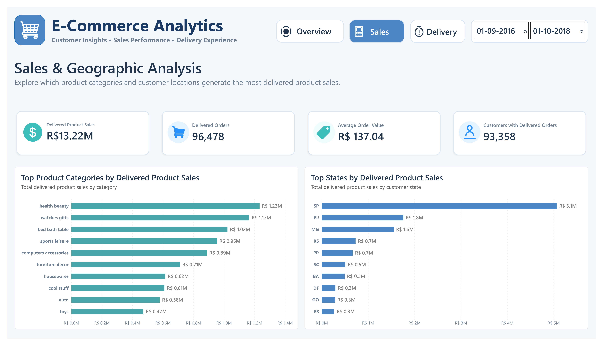
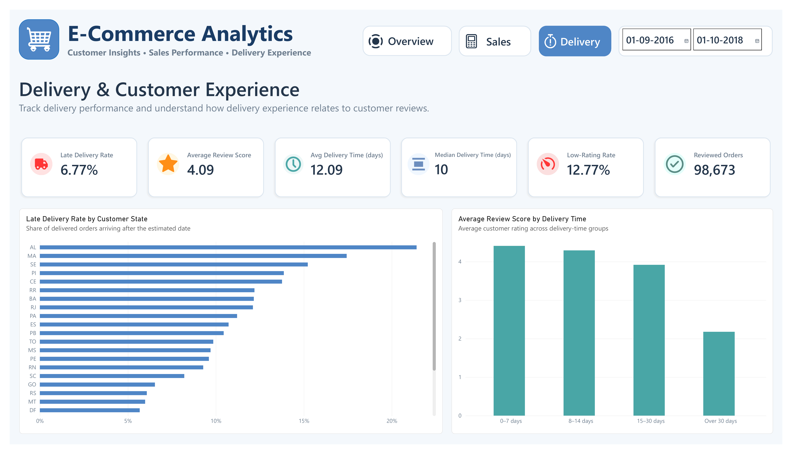

# E-Commerce Growth & Marketing Analytics

End-to-end business analytics project using Python, SQL, DAX, and Power BI to analyze historical e-commerce sales, customers, products, delivery performance, and customer reviews using the Olist public dataset.

## Business Problem

The e-commerce business data is spread across multiple tables covering orders, customers, products, sellers, payments, reviews, and delivery information.

The objective of this project is to combine and analyze these data sources to answer key business questions related to:

- Sales performance
- Product category performance
- Customer purchasing behavior
- Geographic sales distribution
- Delivery performance
- Customer reviews
- Business growth and customer experience opportunities

## Business Questions

This project was designed to answer seven business questions:

1. How much are we selling, and how are sales changing over time?
2. Which product categories perform best and worst?
3. What do customers' purchasing patterns look like?
4. Which customer locations generate the most sales?
5. How well are orders being delivered?
6. What factors are associated with better or worse customer reviews?
7. What actions could improve business growth and customer experience based on the available evidence?

## Dataset

This project uses the Olist Brazilian E-Commerce Public Dataset, which contains historical marketplace data mainly from 2016 to 2018.

The analysis uses nine tables covering:

- Customers
- Orders
- Order items
- Payments
- Reviews
- Products
- Sellers
- Product category translation
- Geolocation

Key dataset considerations:

- The dataset is historical and should not be treated as current market data.
- Product sales are based on `order_items.price`.
- Freight is not included in product sales.
- Profitability cannot be determined because cost and margin data are not available.
- Customer repeat behavior is measured only within the available observation period.

## Tools & Technologies

### Python
Used for data cleaning, validation, missing-value checks, duplicate handling, and preparation of the cleaned datasets.

### SQL
Used to answer the seven business questions, calculate business metrics, validate results, and investigate customer, sales, delivery, geographic, and review patterns.

### Power BI
Used to build the data model, create DAX measures, design the interactive dashboard, and present business insights.

### DAX
Used to create validated KPI measures for sales, orders, delivery performance, customer behavior, and review analysis.

## Project Workflow

The project follows an end-to-end analytics workflow:

1. Define the business problem and business questions
2. Clean and prepare the raw data using Python
3. Analyze the cleaned data using SQL
4. Import the cleaned tables into Power BI
5. Build and validate the Power BI data model
6. Create DAX measures for key business metrics
7. Build the interactive dashboard
8. Validate dashboard results against SQL analysis
9. Identify business insights
10. Develop evidence-based recommendations

## Power BI Dashboard

The final Power BI report contains three main analytical pages:

### Executive Overview
Provides a high-level view of:
- Delivered product sales
- Delivered orders
- Average order value
- Late delivery rate
- Average review score
- Repeat customer rate
- Customer counts
- Monthly sales trend

### Sales & Geographic Analysis
Focuses on:
- Top product categories by delivered product sales
- Top customer states by delivered product sales
- Sales concentration across categories and regions

### Delivery & Customer Experience
Focuses on:
- Late delivery rate
- Delivery time
- Customer review scores
- Low-rating rate
- Late delivery performance by state
- Review score by delivery-time group

The dashboard includes page navigation, date slicers, KPI cards, and interactive cross-filtering between visuals.

## Key Findings

- Delivered product sales totaled **R$ 13.22 million** across **96,478 delivered orders**.
- Average delivered product sales per order were approximately **R$ 137.04**.
- Sales were geographically concentrated, with **São Paulo, Rio de Janeiro, and Minas Gerais** accounting for about **63.38%** of delivered product sales.
- Only **3.00%** of customers with delivered orders placed more than one delivered order during the observed period.
- Repeat customers accounted for approximately **5.51%** of delivered product sales.
- The overall late delivery rate was **6.77%**.
- Late deliveries were associated with substantially lower review scores, with late orders averaging **2.27** compared with **4.29** for non-late orders.
- Health & Beauty was the highest-sales product category, generating approximately **R$ 1.23 million** in delivered product sales.
- Office Furniture had a relatively low average review score of **3.64**, indicating a potential customer-experience issue worth further investigation.

## Business Recommendations

### 1. Investigate and reduce late deliveries
Late orders had much lower average review scores than non-late orders. Delivery performance should be investigated by reviewing seller dispatch times, carrier performance, and regional delivery patterns.

Key metrics to monitor:
- Late delivery rate
- Average days late
- Average review score
- Low-rating rate

### 2. Investigate repeat purchasing
Only 3.00% of customers with delivered orders placed more than one delivered order during the observed period.

Potential next steps:
- Analyze repeat purchasing by category
- Survey first-time customers
- Track second-order behavior within a defined time window
- Identify categories with stronger repeat potential

### 3. Investigate Office Furniture customer experience
Office Furniture had a relatively low average review score.

Potential areas to investigate:
- Product condition
- Packaging
- Assembly experience
- Seller service
- Delivery experience

## Limitations

- The dataset is historical, mainly covering 2016 to 2018, so the findings should not be treated as current market conditions.
- This is a public-dataset portfolio project, not a paid client engagement.
- Product sales are based on `order_items.price` and do not include freight.
- Profitability cannot be determined because cost, margin, and operating-expense data are not available.
- Repeat-customer analysis is limited to the available observation period and should not be interpreted as lifetime retention.
- Relationships between delivery performance and review scores are observational and do not prove causation.
- Some delivered orders are missing actual delivery dates, and some orders contain multiple review records; these cases were handled carefully during analysis.

## Project Outcome

This project demonstrates an end-to-end business analytics workflow using Python, SQL, DAX, and Power BI.

Key outputs include:

- Cleaned and prepared 9-table e-commerce dataset
- SQL analysis for 7 business questions
- Validated Power BI data model
- 14 DAX measures
- Interactive multi-page Power BI dashboard
- 5 evidence-based business insights
- 3 business recommendations
- Professional portfolio case study

## Skills Demonstrated

- Business problem framing
- Data cleaning and validation
- SQL analysis
- Customer analytics
- Sales analytics
- Delivery performance analysis
- Power BI data modeling
- DAX measure development
- Dashboard design
- Business storytelling
- Evidence-based recommendation development

## Repository Structure

```text
ecommerce-growth-marketing-analytics/
│
├── README.md
│
├── notebooks/
│   ├── 01_data_cleaning.ipynb
│   └── 02_SQL_Analysis.ipynb
│
├── documentation/
│   ├── Ecommerce_Growth_Marketing_Analytics_Report.pdf
│   └── Ecommerce_Growth_Marketing_Analytics_Case_Study.docx
│
└── images/
    ├── executive_overview.png
    ├── sales_geographic_analysis.png
    └── delivery_customer_experience.png
```

## Data Source

This project uses the **Olist Brazilian E-Commerce Public Dataset**, a historical public dataset containing marketplace transactions mainly from 2016 to 2018.

The dataset includes information about:

- Orders
- Customers
- Products
- Sellers
- Payments
- Reviews
- Delivery
- Product categories
- Geographic information

This dataset is used only for portfolio and learning purposes. The analysis should not be interpreted as current business performance.

## Dashboard Preview

### Executive Overview



### Sales & Geographic Analysis



### Delivery & Customer Experience



## Interactive Dashboard

The interactive Power BI report is available in the project `.pbix` file.

A public Power BI Service link is not included at this stage because publishing requires a supported work or school account.

## Portfolio Note

This project was created as an independent portfolio case study using a public historical dataset.

It is not a paid client project, and no real-world business impact is claimed. The recommendations are based on patterns observed in the available data and should be validated further before business implementation.
